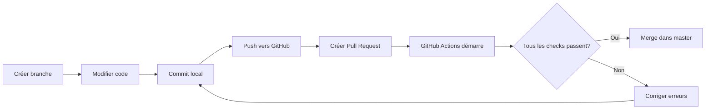

# 🔄 CI/CD avec GitHub Actions

Ce document décrit la configuration CI/CD mise en place pour le projet `ubuntu_post_install`.

## 📋 Vue d'ensemble

Le projet utilise **GitHub Actions** pour automatiser la validation du code à chaque Pull Request vers la branche `master`.

### Workflows configurés

1. **ShellCheck** (`.github/workflows/shellcheck.yml`)
2. **CI - Validation complète** (`.github/workflows/ci.yml`)

## 🔍 Workflow 1 : ShellCheck

### Déclencheurs
- Pull Request vers `master` ou `main`
- Push sur `master` ou `main`
- Uniquement si des fichiers `.sh` sont modifiés

### Ce qui est vérifié
- Analyse statique de tous les scripts shell avec ShellCheck
- Détection des erreurs courantes
- Suggestions de meilleures pratiques
- Niveau de sévérité : `warning` (avertissements inclus)

### Configuration
```yaml
severity: warning
ignore_paths: .git .github
```

## ✅ Workflow 2 : CI - Validation complète

Ce workflow exécute **4 jobs en parallèle** pour une validation rapide et complète.

### Job 1 : ShellCheck Validation
- Utilise l'action `ludeeus/action-shellcheck@master`
- Vérifie tous les scripts shell
- Ignore les dossiers `.git` et `.github`

### Job 2 : Bash Syntax Check
- Valide la syntaxe bash de tous les scripts
- Utilise `bash -n` pour détecter les erreurs de parsing
- Échoue immédiatement si une erreur est trouvée

### Job 3 : Check File Permissions
- Vérifie que `post_install.sh` est exécutable
- Vérifie que tous les modules dans `modules/` sont exécutables
- Garantit que les scripts peuvent être lancés

### Job 4 : Validate Project Structure
- Vérifie la présence des fichiers requis :
  - `post_install.sh`
  - `README.md`
  - `PROMPT.md`
  - `.gitignore`
- Vérifie la présence du dossier `modules/`
- Vérifie que `modules/` contient des scripts shell

## 🛡️ Protection de la branche master

### Configuration recommandée

Pour configurer la protection de branche sur GitHub :

1. Allez dans **Settings** → **Branches** → **Add rule**
2. Branch name pattern : `master`
3. Activez :
   - ✅ Require a pull request before merging
   - ✅ Require status checks to pass before merging
   - ✅ Require branches to be up to date before merging
4. Sélectionnez les status checks requis :
   - `ShellCheck Validation`
   - `Bash Syntax Check`
   - `Check File Permissions`
   - `Validate Project Structure`

Voir [BRANCH_PROTECTION.md](.github/BRANCH_PROTECTION.md) pour plus de détails.

## 📝 Processus de contribution

### 1. Créer une branche feature

```bash
git checkout -b feature/ma-fonctionnalite
```

### 2. Faire les modifications

```bash
# Modifier les fichiers
nano modules/02-dev-tools.sh

# Vérifier localement (recommandé)
shellcheck modules/02-dev-tools.sh
bash -n modules/02-dev-tools.sh
```

### 3. Commit et push

```bash
git add .
git commit -m "feat: ajout de nouvelle fonctionnalité"
git push origin feature/ma-fonctionnalite
```

### 4. Créer une Pull Request

1. Allez sur GitHub
2. Cliquez sur **"Compare & pull request"**
3. Remplissez le template de PR
4. **Attendez que tous les checks passent** ✅
5. Demandez une review si nécessaire
6. Mergez quand tout est vert !

### 5. Les checks s'exécutent automatiquement

GitHub Actions va automatiquement :
- ✅ Analyser tous les scripts avec ShellCheck
- ✅ Vérifier la syntaxe bash
- ✅ Contrôler les permissions des fichiers
- ✅ Valider la structure du projet

## 🚨 Que faire si les checks échouent ?

### ShellCheck échoue

```bash
# Installer ShellCheck localement
sudo apt install shellcheck

# Vérifier le script problématique
shellcheck modules/mon-script.sh

# Corriger les erreurs signalées
# Recommit et repush
git add modules/mon-script.sh
git commit -m "fix: correction des warnings ShellCheck"
git push
```

### Syntaxe bash invalide

```bash
# Tester la syntaxe
bash -n modules/mon-script.sh

# Corriger les erreurs
# Les erreurs de syntaxe sont souvent :
# - Guillemets non fermés
# - Parenthèses déséquilibrées
# - Mots-clés mal orthographiés (if/fi, do/done, etc.)
```

### Permissions incorrectes

```bash
# Rendre les scripts exécutables
chmod +x post_install.sh
chmod +x modules/*.sh

# Vérifier
ls -la modules/

# Commiter les changements de permissions
git add -A
git commit -m "fix: ajout des permissions d'exécution"
git push
```

### Structure du projet invalide

```bash
# Vérifier les fichiers requis
ls -la README.md PROMPT.md .gitignore post_install.sh

# Vérifier le dossier modules
ls -la modules/

# Si des fichiers manquent, créez-les
```

## 🔧 Configuration ShellCheck

Le fichier `.shellcheckrc` configure le comportement de ShellCheck :

```bash
# Désactiver certains warnings
disable=SC2162  # read sans -r
disable=SC1090  # Source dynamique
disable=SC1091  # Fichiers sourcés non suivis

# Activer toutes les vérifications optionnelles
enable=all

# Shell cible
shell=bash
```

## 📊 Badges GitHub Actions

Vous pouvez ajouter des badges à votre README pour montrer le statut des checks :

```markdown


```

## 🎯 Avantages de cette configuration

### ✅ Qualité du code
- Détection automatique des erreurs
- Application des meilleures pratiques
- Code cohérent et maintenable

### ✅ Sécurité
- Validation avant merge sur master
- Impossible de merger du code non valide
- Protection contre les erreurs humaines

### ✅ Collaboration
- Process clair pour les contributions
- Feedback automatique et rapide
- Templates de PR et issues

### ✅ Documentation
- Process bien documenté
- Templates standardisés
- Guides de contribution clairs

## 🔄 Workflow complet



## 📚 Ressources

- [GitHub Actions Documentation](https://docs.github.com/en/actions)
- [ShellCheck Wiki](https://github.com/koalaman/shellcheck/wiki)
- [Bash Best Practices](https://google.github.io/styleguide/shellguide.html)
- [Branch Protection Rules](https://docs.github.com/en/repositories/configuring-branches-and-merges-in-your-repository/managing-protected-branches/about-protected-branches)

## 🎓 Commandes utiles

```bash
# Vérifier tous les scripts localement
find . -name "*.sh" -type f -not -path "./.git/*" -exec shellcheck {} \;

# Tester la syntaxe de tous les scripts
find . -name "*.sh" -type f -not -path "./.git/*" -exec bash -n {} \;

# Vérifier les permissions
find . -name "*.sh" -type f -not -path "./.git/*" -exec ls -l {} \;

# Rendre tous les scripts exécutables
find . -name "*.sh" -type f -not -path "./.git/*" -exec chmod +x {} \;
```

## 💡 Bonnes pratiques

### Avant chaque commit
1. ✅ Vérifier avec ShellCheck
2. ✅ Tester la syntaxe bash
3. ✅ Tester le script dans une VM/container
4. ✅ Vérifier les permissions
5. ✅ Écrire un message de commit clair

### Pendant une Pull Request
1. ✅ Remplir le template de PR
2. ✅ Attendre que les checks passent
3. ✅ Répondre aux commentaires de review
4. ✅ Merger uniquement si tout est vert

### Après le merge
1. ✅ Supprimer la branche feature
2. ✅ Mettre à jour le CHANGELOG si nécessaire
3. ✅ Créer une release si c'est une version majeure

---

**Auteur** : Seb (sebpicot@gmail.com)  
**Version** : 1.1.0  
**Dernière mise à jour** : 2025-11-10
